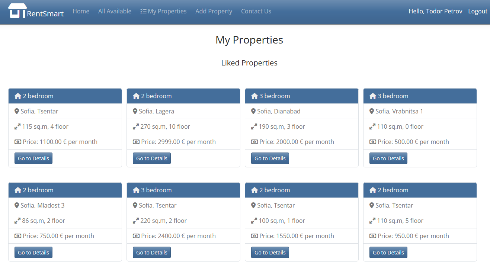
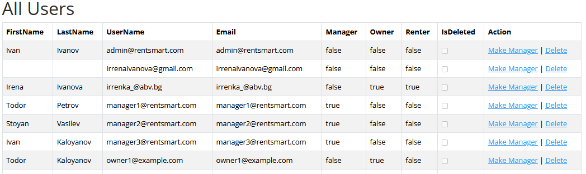

# ASP.NET Core RentSmart
## 🏡 Project Introduction
**RentSmart** is ready-to-use ASP.NET Core 8 application and is the final project for my study in SoftUni

## 📝 Project Description
Finding the right tenant or home, especially for short-term rentals, can be challenging. This app solves that problem by offering a property listing section, services to help owners find the right tenants, and all necessary rental information in one place. Property managers can easily track future appointments, and tenants can find homes for various rental periods. The web application provides a modern graphical interface that combines a wide range of features, making it useful for owners, managers, and tenants alike.

**Description of the roles:** In the app there are only two roles in the context of ASP.NET core - **admin** and **regular user**. However, there are three additional "role positions" managed within the app using principal claims and a new entity, linked to ApplicationUser via a navigational property. These are: **Renter**, **Manager** and **Owner**.
***
**Admin** - UserName: **admin@rentsmart.com** Password: **admin@rentsmart.com**

**Manager** - UserName: **manager1@rentsmart.com** Password: **manager1@rentsmart.com**

**Renter** - UserName: **renter1@example.com** Password: **renter1@example.com**

**Owner** - UserName: **owner1@example.com** Password: **owner1@example.com**
***
**Admin**

The admin role is created by the site owner and has the following privileges:
- **Promote Users:** Can promote a regular user to the role of manager
- **Manage Property Types:** Has the ability to create, update, and delete property types
- **Delete Users:** Can delete users. Soft delete is implemented for all entities in the app, but in compliance with GDPR, sensitive user data is permanently deleted.
- **Hangfire Dashboard Access:** Has access to the Hangfire dashboard (to be implemented only for admins)
***
**Regular User**

By default, all registered users are assigned this role and can perform the following actions:
- **Search Properties:** Search through all available properties with filters like property type, search string, max monthly price, district, and tags. Results can be sorted by criteria such as newest, oldest, ascending/descending price, most likes, and property rating. All results are paginated.
- **Appointments:** 
  - In the property details view, users can book appointments to visit properties. 
  - Appointments can only be made up to 20 days in advance. 
  - After selecting a day, available time slots for the property manager are shown in real-time using AJAX requests.
- **Like/Dislike Properties:** Users can like or dislike properties. Liked properties appear in their **My Properties** view, and the total likes value is updated in real time using AJAX requests.
- **Contact Us:** 
  - The Contact Us form is available for both registered and non-registered users.
  - The form uses Google ReCAPTCHA to prevent DDoS attacks.
  - Submitted inquiries are sent to the admin’s email, and the user receives a thank-you email as confirmation.
***
**Owner**

An owner is a user who has purchased one of the provided services in the app. Their privileges include:
- **Property Ownership:** 
  - When an owner purchases the "Find My New Tenants" package, a manager can add a property linked to the owner.
  - Once a property is added, the package cannot be reused for adding additional properties.
- **View Properties**  Owners have a dedicated view showing all their owned properties, along with detailed information about each property and its associated rental contracts.

***
**Manager**

Managers are promoted users who are responsible for managing properties and rentals. Their privileges include:
- **Property Management**
  - Can add, edit, update, and delete properties.
  - When adding a property, they can:
    - Upload up to five photos.
    - Use a dropdown menu for predefined property tags or add up to four custom tags.
    - Enter prices using either a dot (.) or comma (,) as the decimal separator, thanks to the custom decimal model binder.
  - Newly added properties are listed as "Available" until they are rented.
- **Rental Contracts**
  - Managers can create rental contracts only with users who have attended a previous appointment for the property.
  - The renter is selected from a dropdown menu in the Add Property view.
  - Once a contract is created:
    - The property is marked as "Occupied".
    - A PDF version of the contract is generated and becomes available in the Managed Properties view.
    - The contract is also sent to the renter via email and becomes viewable in their **My Properties** section.
  - **Future Appointments:** Can view upcoming appointments for their properties.

***
**Renter**

A user becomes a renter when a new rental contract is created for them. Renters have the following privileges:
- **Property Access:** Renters can view their rented properties in the **My Properties** section. The section provides detailed information about the properties and their contracts.
- **Ratings** Can rate a property only once, and only after their rental contract for that property has expired.
- **Notifications** Renters receive an email notification three days before their rental contract is set to expire.

***
**Authentication**

The application supports third-party authentication via:
- **Facebook Login**
- **Google Login**
These allow users to log in quickly and securely without needing to create a separate account for the app.

***
**General Features**
- **Success/Error Notifications**
  - All user interactions, such as editing, deleting, or purchasing services, are accompanied by success or error toast messages.
  - Actions like editing, deleting, or buying services are confirmed through modal windows.
- **Error Handling**
  - Custom error pages are displayed for status codes 404 (Not Found) and 500 (Internal Server Error) in production mode.

##  🛠️ Tehnology Stack:
**Backend:**
- ASP.NEt Core 8.0
- Entity Framework Core 8.0
- SQL Server
- HangFire
- SendGrid
- Rotativa

**Frontend:**
- Bootstrap
- JavaScript
- AJAX Real-Time Requests

**Libraries & APIs:**
- Google ReCAPTCHA
- Google for Developers
- Facebook for Developers
- Newtonsoft.Json
- HtmlSanitizer
- AngleSharp
- Font Awasome

**Testing:**
- xUnit
- Moq

## ⚙️ Background processes
**Hangfire** has one registered job
- Hangfire checks all contracts every day, and if a rental contract is set to expire within the next three days, the renter will receive a reminder email  

## 🔗 Link
[https://rentsmartweb20241216205226.azurewebsites.net/](https://rentsmartweb20241216205226.azurewebsites.net/)

##  💾 Database Diagram

## 🤝 Credits
Using ASP.NET-MVC-Template originally developed by:
- [Nikolay Kostov](https://github.com/NikolayIT)
- [Vladislav Karamfilov](https://github.com/vladislav-karamfilov)

**Note:** All the properties in the app are sourced from [imot.info](https://imoti.info/en/) and include the original links. This is done purely for educational purposes, and no commercial use is intended. If requested, the data will be promptly removed.

## 📸 Screenshots:
**Home Page**
***

**All Available**
*** 

**Details**
***

 

**Add Property and Make Rental**
***

**My Properties**
***

**Admin Area**

**Buy Service and Rate Property**

**Contact Form**
***

